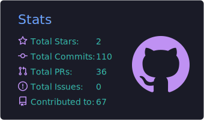
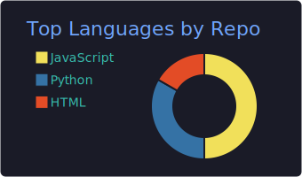
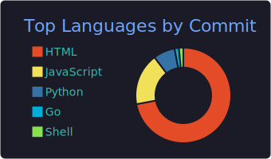

# ⚡ wwhsaber 的训练家主页
### Trainer Card · Kanto / AI Region

**AI Agents · Open Source · Pokémon**

`Lv.??` · `OT: wwhsaber` · `ID: No.25076407`

---

## 🎒 About the Trainer

> “工具要简单，代码别过度设计。出发吧！”

我是一名喜欢做**小而有用**工具的训练家：

| 属性 | 说明 |
|------|------|
| ⚡ Electric | AI Agent 工作流（Hermes / Claude Code / Codex） |
| 🧠 Psychic | 本地代码知识图谱、编排工具 |
| 🔥 Fire | 开源小修小补，高信号 PR |
| 🌿 Grass | 宝可梦图鉴、图标、二创小项目 |

**战斗风格：** Prefer simple tools. Hate over-engineering.

---

## 🃏 Party（出战队伍）

<table>
  <tr>
    <td align="center" width="16%">
       
      <b><a href="https://github.com/wwhsaber/codegraph">codegraph</a></b> 
      Ghost · 知识图谱
    </td>
    <td align="center" width="16%">
       
      <b><a href="https://github.com/wwhsaber/codex-orchestrator">codex-orchestrator</a></b> 
      Psychic · 多智能体
    </td>
    <td align="center" width="16%">
       
      <b><a href="https://github.com/wwhsaber/pokedex">pokedex</a></b> 
      Normal · 双语图鉴
    </td>
    <td align="center" width="16%">
       
      <b><a href="https://github.com/wwhsaber/oss-issue-scout">oss-issue-scout</a></b> 
      Psychic · Issue 侦察
    </td>
    <td align="center" width="16%">
       
      <b><a href="https://github.com/wwhsaber/poke-surge-icons">poke-surge-icons</a></b> 
      Electric · Surge 图标
    </td>
    <td align="center" width="16%">
       
      <b><a href="https://github.com/wwhsaber/hermes-config">hermes-config</a></b> 
      Fairy · Hermes 配置
    </td>
  </tr>
</table>

---

## 📘 Pokédex Entries

| No. | Project | Type | Entry |
|----:|---------|------|-------|
| 001 | [codegraph](https://github.com/wwhsaber/codegraph) | Ghost/Steel | 给 AI 编程代理用的本地代码知识图谱。更少 token，更少瞎调用。 |
| 002 | [codex-orchestrator](https://github.com/wwhsaber/codex-orchestrator) | Psychic | 多智能体编排工具箱，专治复杂任务拆解。 |
| 003 | [pokedex](https://github.com/wwhsaber/pokedex) | Normal | 中英双语宝可梦图鉴，PokeAPI 驱动。 |
| 004 | [oss-issue-scout](https://github.com/wwhsaber/oss-issue-scout) | Flying | 帮你发现值得贡献的开源 Issue。 |
| 005 | [poke-surge-icons](https://github.com/wwhsaber/poke-surge-icons) | Electric | 给 Surge / 网络工具用的宝可梦图标集。 |
| 006 | [hermes-config](https://github.com/wwhsaber/hermes-config) | Fairy | 个人 Hermes Agent 配置、skills 与备份。 |

---

## 🧪 Types / Stack

  
  
  
  
  

---

## 📊 Battle Stats

  
  

 

  

 

  

---

### 🏁 Current Quest
shipping high-signal OSS PRs · tuning agent workflows · catching cute bugs 🐛✨

 

**Wild PR appeared!**  
*Prefer simple tools. Hate over-engineering.*

